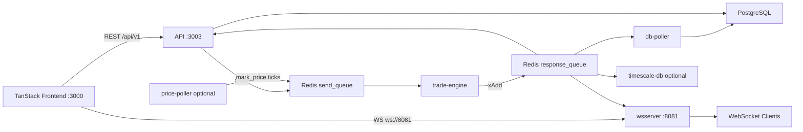

# perps-platform

Perpetual futures trading — matching engine, Redis event bus, Postgres persistence, TanStack trading UI.

**[Run the local demo →](docs/DEMO.md)**

## Demo

#### Trading Flow
https://github.com/user-attachments/assets/fceb973f-2a09-4eb2-bf23-4cc4f66b4726

#### Payments Gateway Integration
https://github.com/user-attachments/assets/5a4d5d2e-8439-47ba-8ca0-c03a11697b2a

## Quick start

1. Redis + Postgres running locally  
2. `cp .env.example .env`  
3. Follow **[docs/DEMO.md](docs/DEMO.md)** (install → migrate → 5 services → `bun run simulate:orderbook`)  
4. Login: `demo@perps.local` / `demo1234`

## Architecture



More diagrams (order flow, matching, liquidation, auth, WebSocket, frontend): **[docs/ARCHITECTURE.md](docs/ARCHITECTURE.md)**

## Services

| Service | Port | Run from root |
| --- | --- | --- |
| `tanstack-frontend` | 3000 | `bun run dev --filter=tanstack-frontend` |
| `api` | 3003 | `bun run dev --filter=api` |
| `wsserver` | 8081 | `bun run dev --filter=wsserver` |
| `trade-engine` | — | `bun run dev --filter=trade-engine` |
| `db-poller` | — | `bun run dev --filter=db-poller` |
| `price-poller` | — | `bun run dev --filter=price-poller` |
| `timescale-db` | — | `bun run dev --filter=timescale-db` |

## Repo layout

```
apps/           api, trade-engine, wsServer, db-poller, tanstack-frontend, …
packages/       database (Prisma), sharedTypes, ui
scripts/        demo-seed, simulate-orderbook
docs/           DEMO.md, ARCHITECTURE.md, assets/demo/
```
