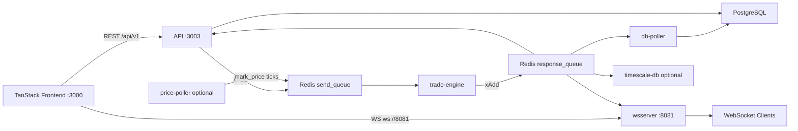

# perps-platform

Perpetual futures trading — matching engine, Redis event bus, Postgres persistence, TanStack trading UI.

**[Run the local demo →](docs/DEMO.md)**

## Demo

<!-- DEMO_VIDEO: Paste a hosted URL below, or commit docs/assets/demo/overview.mp4 and link it here -->
<!-- Example: https://www.youtube.com/watch?v=YOUR_VIDEO_ID -->

> **Video:** Add `docs/assets/demo/overview.mp4` or paste a hosted walkthrough URL above.

| | |
| --- | --- |
|  |  |
| *Dashboard — `docs/assets/demo/dashboard.png`* | *Orderbook — `docs/assets/demo/orderbook.png`* |

More screenshot slots: [`docs/assets/demo/README.md`](docs/assets/demo/README.md)

## Quick start

1. Redis + Postgres running locally  
2. `cp .env.example .env`  
3. Follow **[docs/DEMO.md](docs/DEMO.md)** (install → migrate → 5 services → `bun run simulate:orderbook`)  
4. Login: `demo@perps.local` / `demo1234`

## Architecture



More diagrams (order flow, matching, liquidation, auth, WebSocket, frontend): **[docs/ARCHITECTURE.md](docs/ARCHITECTURE.md)**

## Services

| Service | Port | Run from root |
| --- | --- | --- |
| `tanstack-frontend` | 3000 | `bun run dev --filter=tanstack-frontend` |
| `api` | 3003 | `bun run dev --filter=api` |
| `wsserver` | 8081 | `bun run dev --filter=wsserver` |
| `trade-engine` | — | `bun run dev --filter=trade-engine` |
| `db-poller` | — | `bun run dev --filter=db-poller` |
| `price-poller` | — | optional |
| `timescale-db` | — | optional, needs `DB_URL` |

## Repo layout

```
apps/           api, trade-engine, wsServer, db-poller, tanstack-frontend, …
packages/       database (Prisma), sharedTypes, ui
scripts/        demo-seed, simulate-orderbook
docs/           DEMO.md, ARCHITECTURE.md, assets/demo/
```
