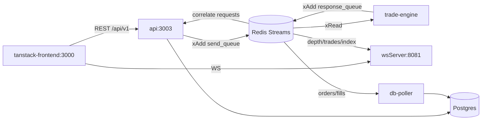

# perps-platform

A perpetual futures trading platform for **BTC** and **SOL**, built as a Bun/Turborepo monorepo. An in-memory matching engine handles order placement and position management; services communicate over **Redis Streams**; orders and fills persist to **Postgres** via an async writer. A TanStack trading terminal provides the live UI.

**What works today:** order placement, live orderbook depth over WebSocket, open positions, funding settlement, and a Razorpay onramp stub.

## Stack

| Layer | Tech |
| --- | --- |
| Runtime / monorepo | Bun 1.3, Turborepo |
| API | Express ([`apps/api`](apps/api)) |
| Engine | In-memory matcher ([`apps/trade-engine`](apps/trade-engine)) |
| Message bus | Redis Streams (`send_queue`, `response_queue` — [`packages/sharedTypes/src/enums.ts`](packages/sharedTypes/src/enums.ts)) |
| Realtime | WebSocket server on **8081** ([`apps/wsServer`](apps/wsServer)) |
| Persistence | Prisma + Postgres ([`packages/database`](packages/database)) |
| Frontend | TanStack Start + Vite on **3000** ([`apps/tanstack-frontend`](apps/tanstack-frontend)) |
| Optional | [`price-poller`](apps/price-poller) (Backpack mark prices), [`timescale-db`](apps/timescale-db) (candles/analytics) |

## Architecture



**How messages flow:** The API writes commands (create order, cancel, get account state) to `send_queue` with a `requestId`. The trade-engine is the sole consumer — it matches orders, updates positions, and publishes to `response_queue`. The API worker reads `response_queue` and correlates responses back to the HTTP caller via `requestId`. Separately, the engine broadcasts market events (depth updates, trades, index price) that `wsServer` fans out to WebSocket clients and `db-poller` persists to Postgres.

## Service map

| Service | Port | Redis role | Other deps |
| --- | --- | --- | --- |
| `trade-engine` | — | Consumes `send_queue`, publishes `response_queue` | Loads snapshot on boot |
| `api` | `PORT` (demo: **3003**) | Produces `send_queue`, consumes `response_queue` | `DATABASE_URL`, `JWT_SECRET` |
| `wsServer` | **8081** | Consumes `response_queue`, broadcasts to clients | — |
| `db-poller` | — | Consumes `response_queue` | `DATABASE_URL` |
| `price-poller` | — | Produces mark-price ticks → `send_queue` | Backpack WS (optional for demo) |
| `tanstack-frontend` | **3000** | — | Proxies API to `localhost:3003` |

## Prerequisites

- [Bun](https://bun.sh) 1.3+ (`packageManager: bun@1.3.5`)
- Redis running locally
- Postgres running locally

Quick start with Docker:

```bash
docker run -d --name perps-redis -p 6379:6379 redis
docker run -d --name perps-pg -e POSTGRES_PASSWORD=postgres -p 5432:5432 postgres
```

## Environment variables

Copy the example file and fill in values:

```bash
cp .env.example .env
```

Bun auto-loads `.env` from the working directory. When running services via turbo from the repo root, they inherit these values.

### Required for core demo

| Variable | Used by | Notes |
| --- | --- | --- |
| `DATABASE_URL` | api, db-poller, Prisma migrate | Postgres connection string |
| `JWT_SECRET` | api auth | Any random string for local dev |
| `PORT` | api | **No default in code** — set `3003` for the frontend proxy |

### Optional / feature-specific

| Variable | Used by |
| --- | --- |
| `ADMIN_API_SECRET` | api admin routes |
| `RAZORPAY_TEST_API_KEY`, `RAZORPAY_TEST_SECRET_KEY` | onramp |
| `FUNDING_INTERVAL_MS` | trade-engine (default 8h) |
| `VITE_API_PROXY_TARGET`, `VITE_WS_URL` | frontend (defaults work locally) |
| `DB_URL` | timescale-db only |
| `REDIS_URL`, `SIM_*` | [`scripts/simulate-orderbook.ts`](scripts/simulate-orderbook.ts) |

Most services connect to Redis via `createClient()` with the default `redis://localhost:6379`. Only the orderbook simulator documents `REDIS_URL`.

## Startup order

Services have dependencies — start them in this order:

1. **Redis** — all services block on connect
2. **Postgres** + migrate: `cd packages/database && bun run db:migrate`
3. **trade-engine** — must be running before commands get processed
4. **api** — needs Redis, DB, and engine for order flow (`PORT=3003`)
5. **wsServer** — live UI needs this for depth/trades
6. **db-poller** — async Postgres writer for orders/fills
7. **price-poller** — optional; mark prices for liquidations/index (or use the simulator)
8. **tanstack-frontend** — last; hits api + ws
9. **simulate-orderbook** — dev liquidity after engine is running

> **Note:** `bun run dev` at the root runs **all** turbo `dev` tasks, including `timescale-db` which requires `DB_URL`. For the standard demo, use per-service filters instead (see below).

## Demo script

Copy-paste setup (~5 minutes):

```bash
# 0. Infra (if not already running)
docker run -d --name perps-redis -p 6379:6379 redis
docker run -d --name perps-pg -e POSTGRES_PASSWORD=postgres -p 5432:5432 postgres

# 1. Install + DB
bun install
cp .env.example .env   # set DATABASE_URL + JWT_SECRET
cd packages/database && bun run db:migrate && cd ../..

# 2. Core services (separate terminals, or background with &)
bun run dev --filter=trade-engine
bun run dev --filter=api
bun run dev --filter=wsserver
bun run dev --filter=db-poller
bun run dev --filter=tanstack-frontend

# 3. Seed liquidity
bun run simulate:orderbook

# 4. Open http://localhost:3000 → /login → /dashboard
```

Ensure `.env` has `PORT=3003`, `JWT_SECRET`, and `DATABASE_URL` before starting the api.

## Liquidity for demo

The orderbook starts empty. Use [`scripts/simulate-orderbook.ts`](scripts/simulate-orderbook.ts) to seed a multi-level BTC book and simulate realistic activity:

```bash
bun run simulate:orderbook
```

**What it does:** creates sim users (IDs 9001–9005), places resting limit orders, executes crosses, and refreshes liquidity on a jittered interval.

**Requires:** Redis + trade-engine (+ wsServer for live depth/trade UI).

**Tunable via env:** `SIM_MID_PRICE`, `SIM_SPREAD`, `SIM_TRADE_PROB`, `SIM_DEPTH_LEVELS`, and more — see the script header for the full list.

## Monorepo layout

```
apps/
  api/               REST + Redis producer/consumer
  trade-engine/      Matching engine
  wsServer/          WebSocket fanout
  db-poller/         Postgres writer
  price-poller/      External mark prices (optional)
  timescale-db/      Analytics consumer (optional)
  tanstack-frontend/ Trading UI
packages/
  database/          Prisma schema + client
  sharedtypes/       Queues, events, asset config
```

## Further reading

- [`notes/FUNDING_RATE.md`](notes/FUNDING_RATE.md) — funding rate implementation
- [`nginx/README.md`](nginx/README.md) — API cluster load test (ports 3001–3003 → nginx 8080)
- [`apps/timescale-db/README.md`](apps/timescale-db/README.md) — optional Timescale setup
