# Architecture

Mermaid diagrams for **perps-platform** — accurate to the current codebase. Paste any block into GitHub, Notion, or any Mermaid renderer.

---

## 1. High-level architecture

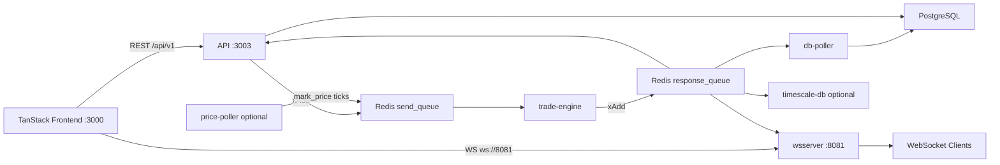

---

## 2. Order creation flow

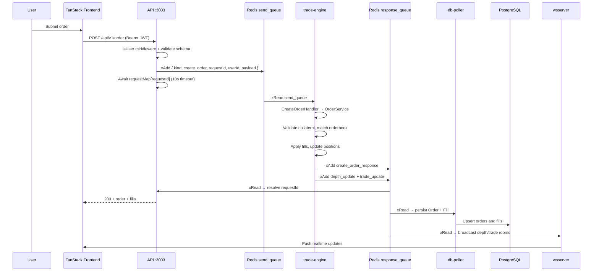

---

## 3. Engine internal flow

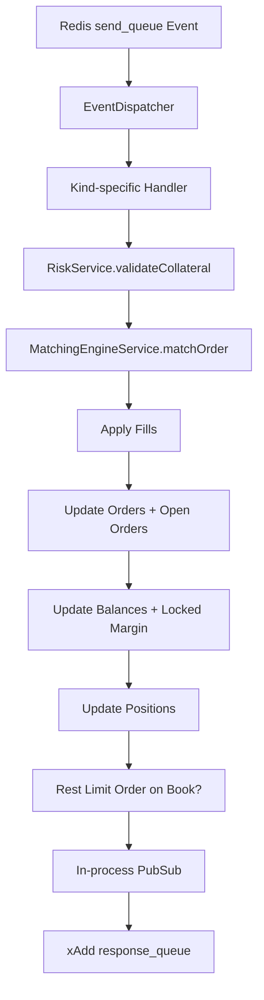

**Supported event kinds:** `create_order`, `cancel_order`, `close_position`, `create_user`, `credit_balance`, `get_open_positions`, `get_open_orders`, `get_account_state`, `get_orderbook`, `mark_price`.

---

## 4. Orderbook matching flow

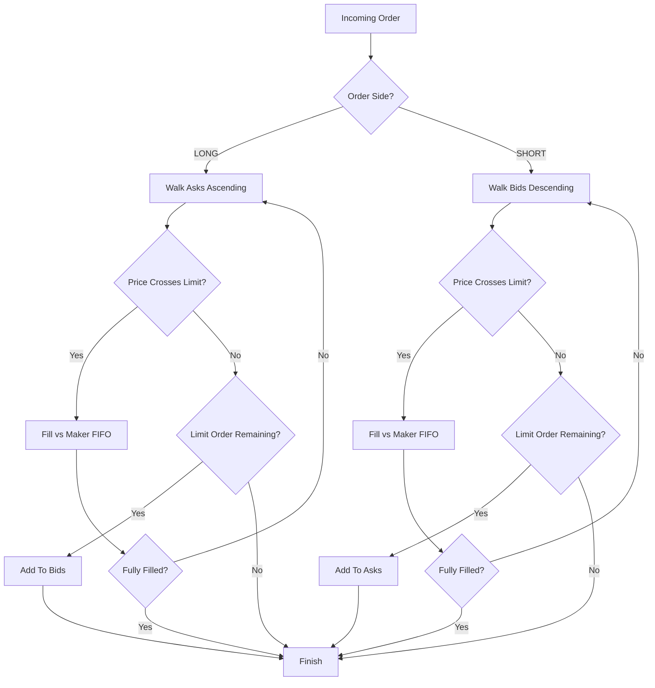

Self-trades are skipped (`makerOrder.userId === takerOrder.userId`). Each fill emits a `trade_update`; book changes emit `depth_update`.

---

## 5. Position lifecycle

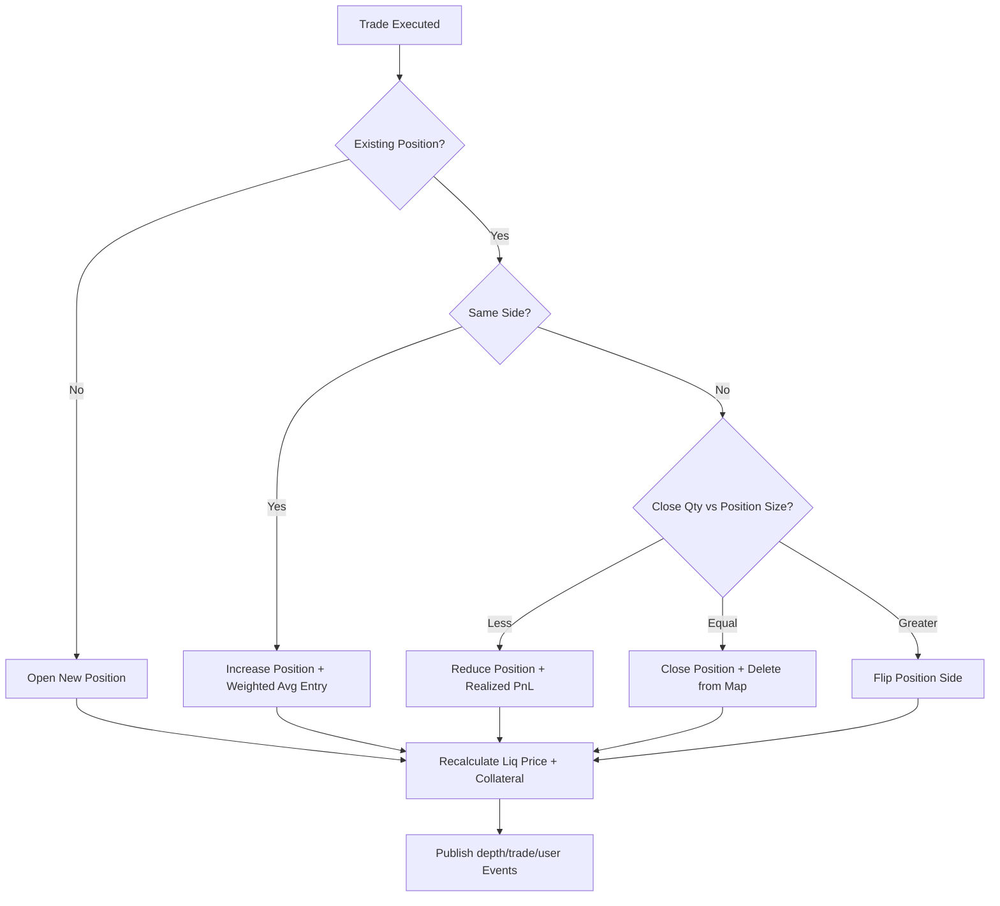

One position per user per market (`{userId}_{market}`). User-initiated close: `POST /api/v1/positions/:market/close` → market order opposite side.

---

## 6. Liquidation flow

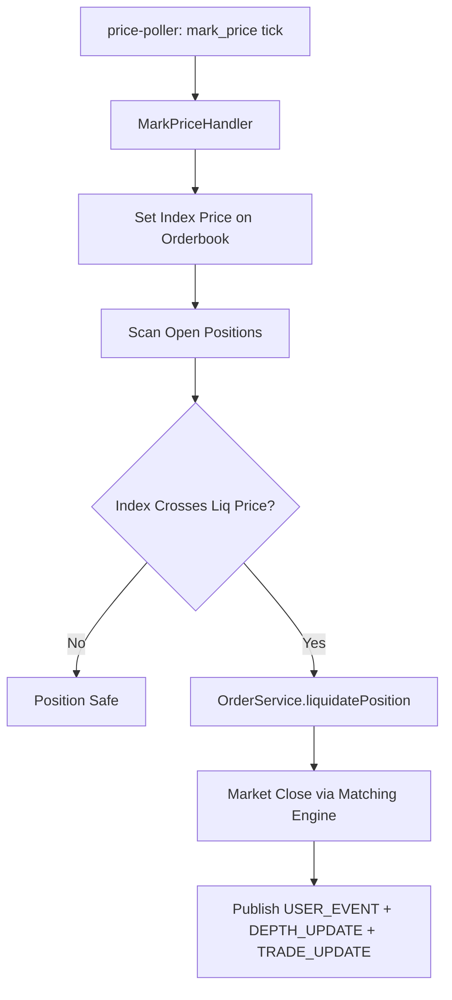

**Trigger:** LONG liquidates when `indexPrice <= estimatedLiquidationPrice`; SHORT when `indexPrice >= estimatedLiquidationPrice`. Maintenance margin rate: 0.5%.

---

## 7. Redis streams architecture

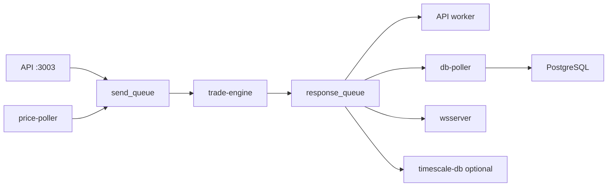

| Stream | Producers | Consumers |
| --- | --- | --- |
| `send_queue` | API, price-poller, simulate script | trade-engine |
| `response_queue` | trade-engine (via in-process PubSub) | API worker, db-poller, wsserver, timescale-db |

Message shape: `{ data: "<JSON string>" }` with `kind`, `requestId`, and `payload`.

---

## 8. WebSocket event architecture

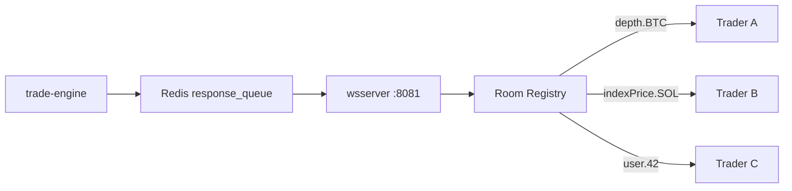

**Room naming:** `depth.{market}`, `indexPrice.{market}`, `trade.{market}`, `user.{userId}`.

**Client protocol:**
```json
{ "method": "SUBSCRIBE", "params": ["depth.BTC", "trade.BTC"] }
```

**Push shape:**
```json
{ "stream": "depth.BTC", "data": { ... } }
```

Push kinds: `depth_update`, `index_price_update`, `trade_update`, `user_event` (e.g. `LIQUIDATION`).

---

## 9. Authentication architecture

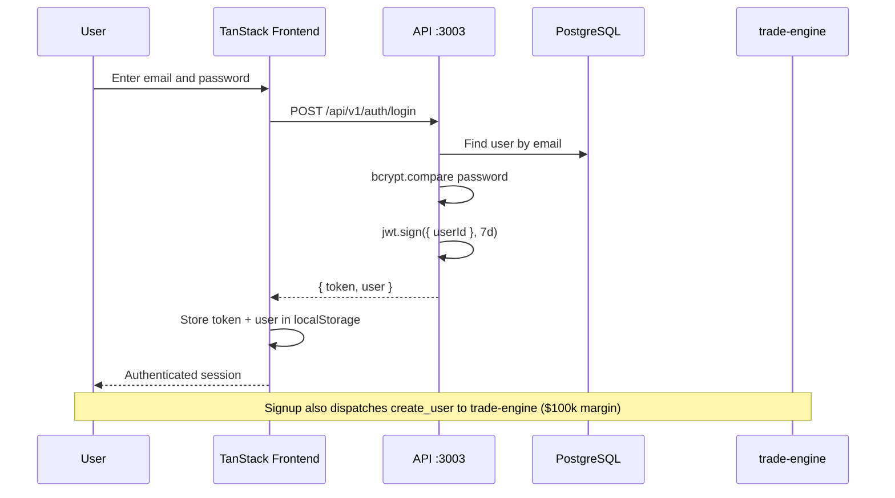

Auth is **JWT + bcrypt** — there is no NextAuth. Session lives in `localStorage` via `auth-storage.ts` and `UserProvider` context.

---

## 10. API authentication flow

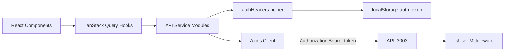

`axiosClient` has a **response** interceptor only (maps `response.data.message` to `Error`). Each protected API module calls `authHeaders()` to attach the Bearer token per request.

---

## 11. WebSocket connection flow

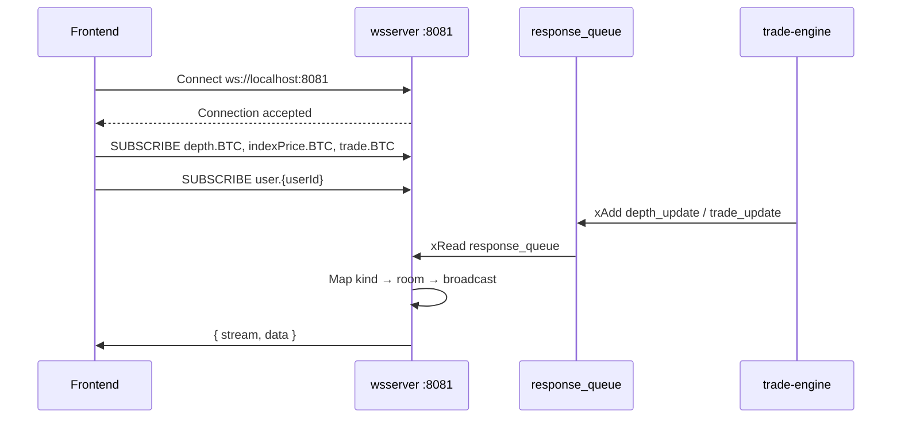

**Note:** WebSocket connections are currently **unauthenticated** — any client can subscribe to any room if they know the room name.

---

## 12. Frontend data flow

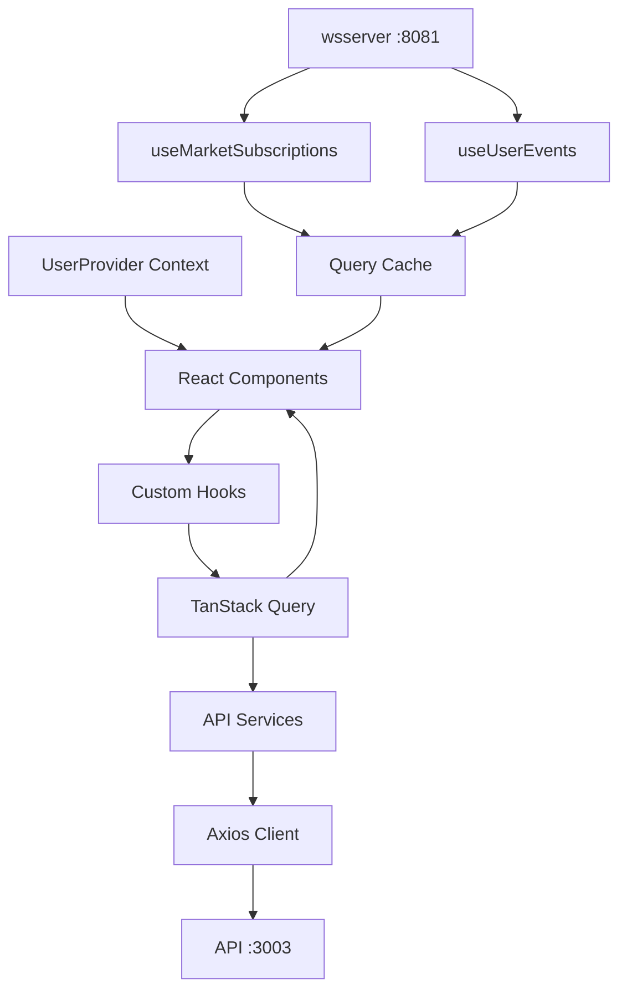

| Hook | Source | Real-time |
| --- | --- | --- |
| `usePlaceOrder`, `useCancelOrder`, `useClosePosition` | REST mutations | Invalidates query cache |
| `usePositions`, `useOpenOrders`, `useOrderHistory` | REST queries | — |
| `useMarketSubscriptions` | WS + initial REST orderbook | Patches depth, ticker, lastTrade cache |
| `useUserEvents` | WS `user.{userId}` | Toast on liquidation, invalidates positions/account |

`useMarketSubscriptions` and `useUserEvents` each open their own WebSocket connection to `:8081`.
